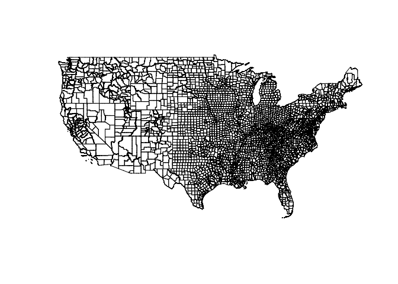

geojsonsf
================

[](http://cran.r-project.org/package=geojsonsf)

[](http://cran.r-project.org/web/packages/geojsonsf/index.html)
[](https://github.com/SymbolixAU/geojsonsf)
[](https://travis-ci.org/SymbolixAU/geojsonsf)
[](https://codecov.io/github/SymbolixAU/geojsonsf?branch=master)

–

## Warning Note: 2018-09-22

I have found [an
issue](https://github.com/SymbolixAU/geojsonsf/issues/32) with `Dates`
and `POSIXct` columns not being handled correctly.

I have made a fix in the development version, but I am not able to
upload to CRAN until the down-stream `rapidjson` library [fixes
gcc-compiler](https://github.com/SymbolixAU/geojsonsf/issues/27)
warnings.

In order to handle `Dates` and `POSIXct` columns correctly you will need
to convert them to characters first.

-----

## geojsonsf

A simple, low-dependency and **fast** converter between GeoJSON and
Simple Feature objects in R.

-----

**v1.1**

Converts

  - GeoJSON –\> `sf`
  - GeoJSON –\> `sfc`
  - `sf` –\> GeoJSON
  - `sfc` –\> GeoJSON
  - GeoJSON –\> Well-known text

As per GeoJSON ([RFC 7946
specification)](https://tools.ietf.org/html/rfc7946#page-11), foreign
members are ignored, and nested objects and arrays inside the
`properties` object are converted to string/characters.

## Installation

When released on CRAN you install it in the usual way

``` r
install.packages("geojsonsf")
```

Install the development version from GitHub with

``` r
# install.packages("devtools")
devtools::install_github("SymbolixAU/geojsonsf")
```

## Motivation

To quickly parse between GeoJSON and `sf` objects, and to handle cases
not supported by `sf`, e.g. arrays of geometries

### Arrays of GeoJSON

``` r

js <- '[
{
  "type": "FeatureCollection",
  "features": [
  {
    "type": "Feature",
    "properties": {"id":1,"val":true},
    "geometry": {"type": "Point", "coordinates": [100.0, 0.0]}
  },
  {
    "type": "Feature",
    "properties": {"id":2,"val":false},
    "geometry": {"type": "LineString", "coordinates": [[201.0, 0.0], [102.0, 1.0]]}
  },
  {
    "type": "Feature",
        "properties": {"id":3},
        "geometry": {"type": "LineString", "coordinates": [[301.0, 0.0], [102.0, 1.0]]}
    }
 ]
},
{
  "type": "FeatureCollection",
    "features": [
    {
      "type": "Feature",
      "properties": {"id":1},
      "geometry": {"type": "Point", "coordinates": [100.0, 0.0]}
    },
    {
      "type": "Feature",
      "properties": {"val":false},
      "geometry": {"type": "LineString", "coordinates": [[501.0, 0.0], [102.0, 1.0]]}
    },
    {
      "type": "Feature",
      "properties": {"hello":"world"},
      "geometry": {"type": "LineString", "coordinates": [[601.0, 0.0], [102.0, 1.0]]}
    }
  ]
}
]'

sf <- geojson_sf(js)
sf
#  Simple feature collection with 6 features and 3 fields
#  geometry type:  GEOMETRY
#  dimension:      XY
#  bbox:           xmin: 100 ymin: 0 xmax: 601 ymax: 1
#  epsg (SRID):    4326
#  proj4string:    +proj=longlat +datum=WGS84 +no_defs
#                     geometry hello id  val
#  1             POINT (100 0)  <NA>  1    1
#  2 LINESTRING (201 0, 102 1)  <NA>  2    0
#  3 LINESTRING (301 0, 102 1)  <NA>  3 <NA>
#  4             POINT (100 0)  <NA>  1 <NA>
#  5 LINESTRING (501 0, 102 1)  <NA> NA    0
#  6 LINESTRING (601 0, 102 1) world NA <NA>
```

And back again to GeoJSON

``` r
js <- sf_geojson(sf)
jsonlite::prettify(js)
#  {
#      "type": "FeatureCollection",
#      "features": [
#          {
#              "type": "Feature",
#              "properties": {
#                  "hello": null,
#                  "id": 1,
#                  "val": "1"
#              },
#              "geometry": {
#                  "type": "Point",
#                  "coordinates": [
#                      100,
#                      0
#                  ]
#              }
#          },
#          {
#              "type": "Feature",
#              "properties": {
#                  "hello": null,
#                  "id": 2,
#                  "val": "0"
#              },
#              "geometry": {
#                  "type": "LineString",
#                  "coordinates": [
#                      [
#                          201,
#                          0
#                      ],
#                      [
#                          102,
#                          1
#                      ]
#                  ]
#              }
#          },
#          {
#              "type": "Feature",
#              "properties": {
#                  "hello": null,
#                  "id": 3,
#                  "val": null
#              },
#              "geometry": {
#                  "type": "LineString",
#                  "coordinates": [
#                      [
#                          301,
#                          0
#                      ],
#                      [
#                          102,
#                          1
#                      ]
#                  ]
#              }
#          },
#          {
#              "type": "Feature",
#              "properties": {
#                  "hello": null,
#                  "id": 1,
#                  "val": null
#              },
#              "geometry": {
#                  "type": "Point",
#                  "coordinates": [
#                      100,
#                      0
#                  ]
#              }
#          },
#          {
#              "type": "Feature",
#              "properties": {
#                  "hello": null,
#                  "id": null,
#                  "val": "0"
#              },
#              "geometry": {
#                  "type": "LineString",
#                  "coordinates": [
#                      [
#                          501,
#                          0
#                      ],
#                      [
#                          102,
#                          1
#                      ]
#                  ]
#              }
#          },
#          {
#              "type": "Feature",
#              "properties": {
#                  "hello": "world",
#                  "id": null,
#                  "val": null
#              },
#              "geometry": {
#                  "type": "LineString",
#                  "coordinates": [
#                      [
#                          601,
#                          0
#                      ],
#                      [
#                          102,
#                          1
#                      ]
#                  ]
#              }
#          }
#      ]
#  }
#  
```

### Speed

This benchmark shows a comparison with `library(sf)` for converting a
string of GeoJSON of 3,221 counties in the US in to an `sf`
object

``` r
myurl <- "http://eric.clst.org/assets/wiki/uploads/Stuff/gz_2010_us_050_00_500k.json"
geo <- readLines(myurl)
geo <- paste0(geo, collapse = "")

library(microbenchmark)

microbenchmark(
    geojsonsf = {
        geojson_sf(geo)
    },
    sf = {
        sf::st_read(geo, quiet = T)
    },
    times = 2
)
#  Unit: seconds
#        expr      min       lq     mean   median      uq     max neval
#   geojsonsf 1.407215 1.407215 1.431913 1.431913 1.45661 1.45661     2
#          sf 4.049296 4.049296 4.090843 4.090843 4.13239 4.13239     2
```

Reading directly from a URL is comparable between the
two

``` r
myurl <- "http://eric.clst.org/assets/wiki/uploads/Stuff/gz_2010_us_050_00_500k.json"

library(microbenchmark)

microbenchmark(
    geojsonsf = {
        geojson_sf(myurl)
    },
    sf = {
        sf::st_read(myurl, quiet = T)
    },
    times = 2
)
#  Unit: seconds
#        expr       min        lq      mean    median       uq      max neval
#   geojsonsf  6.285199  6.285199  7.550965  7.550965  8.81673  8.81673     2
#          sf 13.268988 13.268988 14.462881 14.462881 15.65677 15.65677     2
```

    library(rgdal)
    microbenchmark(
        gdal = {
        readOGR(myurl, "OGRGeoJSON")
        },
        geojsonsf = {
            myurl <- "http://eric.clst.org/assets/wiki/uploads/Stuff/gz_2010_us_050_00_500k.json"
            geo <- readLines(myurl)
            geo <- paste0(geo, collapse = "")
            geojson_sf(geo)
        },
        times = 5
    )
    #      expr      min       lq     mean   median       uq      max neval
    #      gdal 58.51037 60.05683 66.33925 65.07506 72.08371 75.97028     5
    # geojsonsf 11.91515 13.37422 14.02232 13.88782 14.61826 16.31612     5

A visual check to see both objects are the same

``` r
library(googleway)
set_key("GOOGLE_MAP_KEY")

gsf <- geojson_sf(geo)

google_map() %>%
    add_polygons(gsf[!gsf$STATE %in% c("02","15","72"), ], 
            fill_colour = "CENSUSAREA", 
            stroke_weight = 0)
```


``` r
sf <- sf::st_read(geo, quiet = T)
plot(st_geometry(sf[!sf$STATE %in% c("02", "15", "72"), ]))
```


