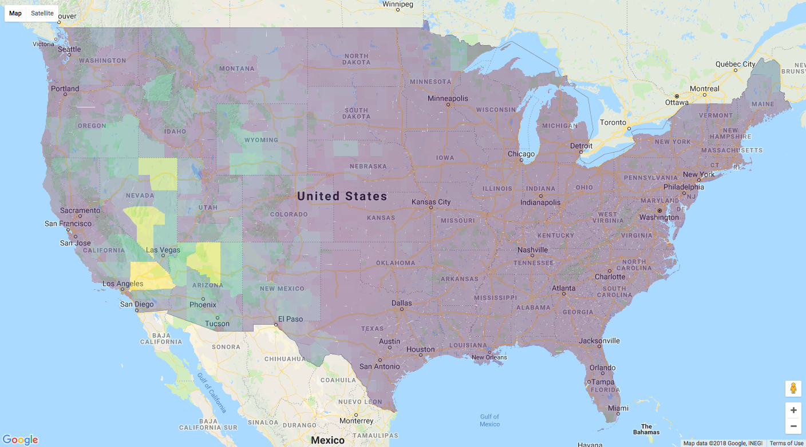

geojsonsf
================

[](http://cran.r-project.org/package=geojsonsf)

[](http://cran.r-project.org/web/packages/geojsonsf/index.html)
[](https://github.com/SymbolixAU/geojsonsf)
[](https://travis-ci.org/SymbolixAU/geojsonsf)
[](https://codecov.io/github/SymbolixAU/geojsonsf?branch=master)

geojsonsf
---------

**v0.2**

Converts GeoJSON ([RFC 7946
specification)](https://tools.ietf.org/html/rfc7946#page-11) to

-   `sf` and `sfc` objects
-   Well-Known Text

As per RFC 7946, foreign members are ignored, and nested objects and
arrays inside the `properties` object are converted to
string/characters.

Installation
------------

When released on CRAN you install it in the usual way

``` r
install.packages("geojsonsf")
```

Install the development version from GitHub with

``` r
# install.packages("devtools")
devtools::install_github("SymbolixAU/geojsonsf")
```

Motivation
----------

To quickly parse GeoJSON to `sf` objects, and to handle cases not
supported by `sf`, e.g. arrays of geometries

### Array of geometries

``` r
library(geojsonsf)
library(sf)        ## for sf print methods
#  Linking to GEOS 3.6.1, GDAL 2.1.3, proj.4 4.9.3

js <- '[
{
  "type": "FeatureCollection",
  "features": [
  {
    "type": "Feature",
    "properties": null,
    "geometry": {"type": "Point", "coordinates": [100.0, 0.0]}
  },
  {
    "type": "Feature",
    "properties": null,
    "geometry": {"type": "LineString", "coordinates": [[201.0, 0.0], [102.0, 1.0]]}
  },
  {
    "type": "Feature",
        "properties": null,
        "geometry": {"type": "LineString", "coordinates": [[301.0, 0.0], [102.0, 1.0]]}
    }
 ]
},
{
  "type": "FeatureCollection",
    "features": [
    {
      "type": "Feature",
      "properties": null,
      "geometry": {"type": "Point", "coordinates": [100.0, 0.0]}
    },
    {
      "type": "Feature",
      "properties": null,
      "geometry": {"type": "LineString", "coordinates": [[501.0, 0.0], [102.0, 1.0]]}
    },
    {
      "type": "Feature",
      "properties": null,
      "geometry": {"type": "LineString", "coordinates": [[601.0, 0.0], [102.0, 1.0]]}
    }
  ]
}
]'

geojson_sf(js)
#  Simple feature collection with 6 features and 0 fields
#  geometry type:  GEOMETRY
#  dimension:      XY
#  bbox:           xmin: 100 ymin: 0 xmax: 601 ymax: 1
#  epsg (SRID):    4326
#  proj4string:    +proj=longlat +datum=WGS84 +no_defs
#                     geometry
#  1             POINT (100 0)
#  2 LINESTRING (201 0, 102 1)
#  3 LINESTRING (301 0, 102 1)
#  4             POINT (100 0)
#  5 LINESTRING (501 0, 102 1)
#  6 LINESTRING (601 0, 102 1)
```

### Speed

This benchmark shows a comparison with `library(sf)` for converting
GeoJSON of 3,221 counties in the US in to an `sf` object

``` r
library(RCurl)
#  Loading required package: bitops
myurl <- "http://eric.clst.org/assets/wiki/uploads/Stuff/gz_2010_us_050_00_500k.json"
geo <- readLines(url(myurl))
geo <- paste0(geo, collapse = "")

library(microbenchmark)

microbenchmark(
    geojsonsf = {
        geojson_sf(geo)
    },
    sf = {
        sf::st_read(geo, quiet = T)
    },
    times = 2
)
#  Unit: milliseconds
#        expr       min        lq     mean   median        uq       max neval
#   geojsonsf  494.5853  494.5853  560.080  560.080  625.5747  625.5747     2
#          sf 3917.9244 3917.9244 4039.329 4039.329 4160.7340 4160.7340     2
```

    library(rgdal)
    microbenchmark(
        gdal = {
        readOGR(myurl, "OGRGeoJSON")
        },
        geojsonsf = {
            myurl <- "http://eric.clst.org/assets/wiki/uploads/Stuff/gz_2010_us_050_00_500k.json"
            geo <- readLines(url(myurl))
            geo <- paste0(geo, collapse = "")
            geojson_sf(geo)
        },
        times = 5
    )
    # Unit: seconds
    #      expr       min        lq      mean    median        uq       max neval
    #      gdal 101.35865 104.05475 109.58369 110.44524 115.57287 116.48696     5
    # geojsonsf  21.74936  27.25304  26.79775  27.41131  27.68181  29.89324     5

A visual check to see both objects are the same

``` r
library(googleway)
gsf <- geojson_sf(geo)

google_map() %>%
    add_polygons(gsf[!gsf$STATE %in% c("02","15","72") ], 
            fill_colour = "CENSUSAREA", 
            stroke_weight = 0)
```



``` r
sf <- st_read(geo, quiet = T)
plot(st_geometry(sf[!sf$STATE %in% c("02", "15", "72"), ]))
```


Examples
--------

Here are more examples of parsing various GeoJSON geometries.

### Geometry

``` r
g <- '{"type": "Point", "coordinates": [100.0, 0.0]}'
geojson_sf(g)
#  Simple feature collection with 1 feature and 0 fields
#  geometry type:  POINT
#  dimension:      XY
#  bbox:           xmin: 100 ymin: 0 xmax: 100 ymax: 0
#  epsg (SRID):    4326
#  proj4string:    +proj=longlat +datum=WGS84 +no_defs
#         geometry
#  1 POINT (100 0)
```

### Feature

``` r
f <- '{
    "type": "Feature",
    "properties": null,
    "geometry": {
      "type": "LineString", 
      "coordinates": [[101.0, 0.0], [102.0, 1.0]]
      }
    }'
geojson_sf(f)
#  Simple feature collection with 1 feature and 0 fields
#  geometry type:  LINESTRING
#  dimension:      XY
#  bbox:           xmin: 101 ymin: 0 xmax: 102 ymax: 1
#  epsg (SRID):    4326
#  proj4string:    +proj=longlat +datum=WGS84 +no_defs
#                     geometry
#  1 LINESTRING (101 0, 102 1)
```

Geometry Collection
-------------------

``` r
gc <- '{
  "type": "GeometryCollection",
  "geometries": [
    {"type": "Point", "coordinates": [100.0, 0.0]},
    {"type": "LineString", "coordinates": [[101.0, 0.0], [102.0, 1.0]]},
    {"type" : "MultiPoint", "coordinates" : [[0,0], [1,1], [2,2]]}
  ]
}'
geojson_sf(gc)
#  Simple feature collection with 1 feature and 0 fields
#  geometry type:  GEOMETRY
#  dimension:      XY
#  bbox:           xmin: 0 ymin: 0 xmax: 102 ymax: 2
#  epsg (SRID):    4326
#  proj4string:    +proj=longlat +datum=WGS84 +no_defs
#                          geometry
#  1 GEOMETRYCOLLECTION (POINT (...
```

### Feature Collection

``` r
fc <- '{
  "type": "FeatureCollection",
  "features": [
  {
    "type": "Feature",
    "properties": {"foo" : "feature 1.1", "bar" : "feature 1.2"},
    "geometry": {"type": "Point", "coordinates": [100.0, 0.0]}
  },
  {
    "type": "Feature",
    "properties": null,
    "geometry": {"type": "LineString", "coordinates": [[101.0, 0.0], [102.0, 1.0]]}
  },
  {
    "type": "Feature",
        "properties": {"foo" : "feature 3.1", "bar" : "feature 3.2"},
        "geometry": {"type": "LineString", "coordinates": [[101.0, 0.0], [102.0, 1.0]]}
    }
 ]
}'
geojson_sf(fc)
#  Simple feature collection with 3 features and 2 fields
#  geometry type:  GEOMETRY
#  dimension:      XY
#  bbox:           xmin: 100 ymin: 0 xmax: 102 ymax: 1
#  epsg (SRID):    4326
#  proj4string:    +proj=longlat +datum=WGS84 +no_defs
#            bar         foo                  geometry
#  1 feature 1.2 feature 1.1             POINT (100 0)
#  2        <NA>        <NA> LINESTRING (101 0, 102 1)
#  3 feature 3.2 feature 3.1 LINESTRING (101 0, 102 1)
```

Reading from file (using `geojsonio` data)

``` r
library(sf) ## for print methods
file <- system.file("examples", "california.geojson", package = "geojsonio")

geo <- paste0(readLines(file), collapse = "")
geojsonsf::geojson_sf(geo)
#  Simple feature collection with 1 feature and 11 fields
#  geometry type:  MULTIPOLYGON
#  dimension:      XY
#  bbox:           xmin: -124.4096 ymin: 32.53416 xmax: -114.1315 ymax: 42.00952
#  epsg (SRID):    4326
#  proj4string:    +proj=longlat +datum=WGS84 +no_defs
#    abbreviation   area    capital        city
#  1           CA 423968 Sacramento Los Angeles
#                          geometry     group houseseats landarea       name
#  1 MULTIPOLYGON (((-120.2485 3... US States         53   403466 California
#    population  statehood waterarea
#  1   38332521 1850-09-09     20502
```

Well-known Text
---------------

It also converts GeoJSON to Well-Known Text and returns a `data.frame`

``` r
fc <- '{
  "type": "FeatureCollection",
  "features": [
  {
    "type": "Feature",
    "properties": {"foo" : "feature 1.1", "bar" : "feature 1.2"},
    "geometry": {"type": "Point", "coordinates": [100.0, 0.0]}
  },
  {
    "type": "Feature",
    "properties": null,
    "geometry": {"type": "LineString", "coordinates": [[101.0, 0.0], [102.0, 1.0]]}
  },
  {
    "type": "Feature",
        "properties": {"foo" : "feature 3.1", "bar" : "feature 3.2"},
        "geometry": {"type": "LineString", "coordinates": [[101.0, 0.0], [102.0, 1.0]]}
    }
 ]
}'
geojson_wkt(fc)
#            bar         foo                  geometry
#  1 feature 1.2 feature 1.1             POINT (100 0)
#  2        <NA>        <NA> LINESTRING (101 0, 102 1)
#  3 feature 3.2 feature 3.1 LINESTRING (101 0, 102 1)
```
