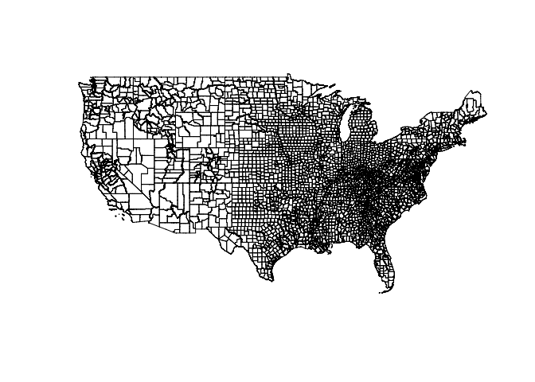

geojsonsf
================

[](https://CRAN.R-project.org/package=geojsonsf)

[](https://CRAN.R-project.org/package=geojsonsf)
[](https://github.com/SymbolixAU/geojsonsf)
[](https://travis-ci.org/SymbolixAU/geojsonsf)
[](https://codecov.io/github/SymbolixAU/geojsonsf?branch=master)

–

## geojsonsf

A simple, low-dependency and **fast** converter between GeoJSON and
Simple Feature objects in R.

-----

**v1.2**

Converts

  - GeoJSON –\> `sf`
  - GeoJSON –\> `sfc`
  - `sf` –\> GeoJSON
  - `sfc` –\> GeoJSON
  - GeoJSON –\> Well-known text

As per GeoJSON ([RFC 7946
specification)](https://tools.ietf.org/html/rfc7946#page-11), foreign
members are ignored, and nested objects and arrays inside the
`properties` object are converted to string/characters.

## Installation

Install the CRAN version with

``` r
install.packages("geojsonsf")
```

To install the development version

``` r
# install.packages("devtools")
devtools::install_github("SymbolixAU/geojsonsf")
```

## Why did you build it?

To quickly parse between GeoJSON and `sf` objects, and to handle cases
not supported by `sf`, e.g. arrays of geometries

## What do you mean, ‘cases not supported’

For example, `sf` can’t read an array of GeoJSON objects, so I wanted to
make this work

``` r
js <- c(
    '[
      {"type":"Point","coordinates":[0,0]},
      {"type":"LineString","coordinates":[[-1,-1],[1,1]]},
        {
      "type": "FeatureCollection",
      "features": [
      {
        "type": "Feature",
        "properties": {"id":1},
        "geometry": {"type": "Point", "coordinates": [100.0, 0.0]}
      }
    ]
  }
    ]'
)

sf <- geojson_sf( js )
sf
#  Simple feature collection with 3 features and 1 field
#  geometry type:  GEOMETRY
#  dimension:      XY
#  bbox:           xmin: -1 ymin: -1 xmax: 100 ymax: 1
#  epsg (SRID):    4326
#  proj4string:    +proj=longlat +datum=WGS84 +no_defs
#    id                geometry
#  1 NA             POINT (0 0)
#  2 NA LINESTRING (-1 -1, 1 1)
#  3  1           POINT (100 0)
```

And going the other way you can also return a vector of GeoJSON

``` r
js <- sf_geojson( sf, atomise = T )
js
#  {"type":"Feature","properties":{"id":null},"geometry":{"type":"Point","coordinates":[0.0,0.0]}} 
#  {"type":"Feature","properties":{"id":null},"geometry":{"type":"LineString","coordinates":[[-1.0,-1.0],[1.0,1.0]]}} 
#  {"type":"Feature","properties":{"id":1.0},"geometry":{"type":"Point","coordinates":[100.0,0.0]}}
```

### What’s the benefit of ‘atomising’?

It’s useful for when you work with geospatial databases and want an
individual record for each individual feature.

### What happens if you don’t `atomise`?

You get a single GeoJSON object

``` r
sf_geojson( sf )
#  {"type":"FeatureCollection","features":[{"type":"Feature","properties":{"id":null},"geometry":{"type":"Point","coordinates":[0.0,0.0]}},{"type":"Feature","properties":{"id":null},"geometry":{"type":"LineString","coordinates":[[-1.0,-1.0],[1.0,1.0]]}},{"type":"Feature","properties":{"id":1.0},"geometry":{"type":"Point","coordinates":[100.0,0.0]}}]}
```

### Can you remove the properites and just return the geometries

Yes. Call `sfc_geojson()` on the `sfc` object.

``` r
sfc_geojson( sf$geometry )
#  {"type":"Point","coordinates":[0.0,0.0]} 
#  {"type":"LineString","coordinates":[[-1.0,-1.0],[1.0,1.0]]} 
#  {"type":"Point","coordinates":[100.0,0.0]}
```

### If I have an `sf` object without any properties, why does it ‘atomise’ by default?

``` r
sf$id <- NULL
sf_geojson( sf )
#  {"type":"Point","coordinates":[0.0,0.0]} 
#  {"type":"LineString","coordinates":[[-1.0,-1.0],[1.0,1.0]]} 
#  {"type":"Point","coordinates":[100.0,0.0]}
```

The `simplify` argument is `TRUE` by default, and it will try and
‘simplify’ the GeoJSON. If there are no properties in the `sf` object,
then the GeoJSON won’t have any properties.

However, if you set `simplify = FALSE` you’ll get a FeatureCollection
with an empty properties field.

``` r
sf_geojson(sf, simplify = F)
#  {"type":"FeatureCollection","features":[{"type":"Feature","properties":{},"geometry":{"type":"Point","coordinates":[0.0,0.0]}},{"type":"Feature","properties":{},"geometry":{"type":"LineString","coordinates":[[-1.0,-1.0],[1.0,1.0]]}},{"type":"Feature","properties":{},"geometry":{"type":"Point","coordinates":[100.0,0.0]}}]}
```

### How fast is it?

This benchmark shows a comparison with `library(sf)` for converting a
string of GeoJSON of 3,221 counties in the US in to an `sf`
object

``` r
myurl <- "http://eric.clst.org/assets/wiki/uploads/Stuff/gz_2010_us_050_00_500k.json"
geo <- readLines(myurl)
geo <- paste0(geo, collapse = "")

library(microbenchmark)

microbenchmark(
    geojsonsf = {
        geojson_sf(geo)
    },
    sf = {
        sf::st_read(geo, quiet = T)
    },
    times = 2
)
#  Unit: seconds
#        expr      min       lq     mean   median       uq      max neval
#   geojsonsf 1.513821 1.513821 1.620952 1.620952 1.728084 1.728084     2
#          sf 4.160896 4.160896 4.368904 4.368904 4.576913 4.576913     2
```

### Does it work?

I’ve written a [lot of
tests](https://github.com/SymbolixAU/geojsonsf/tree/master/tests/testthat)
to try and capture all eventualities. But if you find a mistake please
let me know.

Here’s a quick visual check to see the output of the above benchmark
data

``` r
library(googleway)
set_key("GOOGLE_MAP_KEY")

gsf <- geojson_sf(geo)

google_map() %>%
    add_polygons(gsf[!gsf$STATE %in% c("02","15","72"), ], 
            fill_colour = "CENSUSAREA", 
            stroke_weight = 0)
```


``` r
sf <- sf::st_read(geo, quiet = T)
plot(st_geometry(sf[!sf$STATE %in% c("02", "15", "72"), ]))
```


